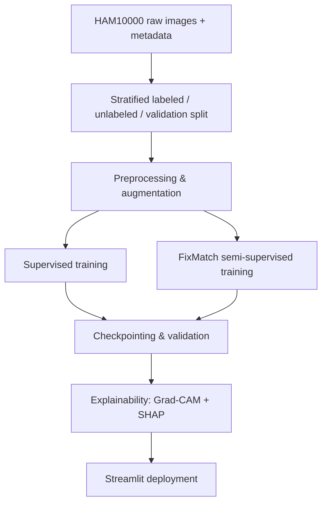
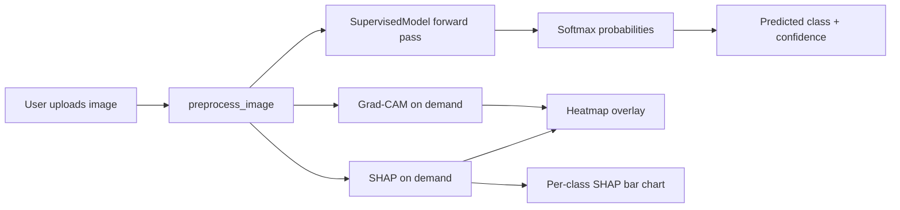

# Thesis Abstract

## Skin Cancer Classification from Dermatoscopic Images Using Semi-Supervised Deep Learning with Explainable AI

Skin cancer is among the most common cancers worldwide, and early, accurate diagnosis
significantly improves patient outcomes. Automated classification of dermatoscopic
images offers a scalable way to support clinicians, but building high-performing models
is often constrained by the limited availability of expert-labeled data. This thesis
addresses that constraint by combining supervised and semi-supervised deep learning
techniques for multi-class skin lesion classification, while incorporating
explainability methods to make model predictions interpretable and clinically
trustworthy.

The proposed system is built around a ResNet18 convolutional neural network trained on
the HAM10000 dataset, which contains dermatoscopic images spanning seven diagnostic
categories: melanocytic nevus, melanoma, benign keratosis, basal cell carcinoma,
actinic keratosis, vascular lesion, and dermatofibroma. Two training strategies are
studied and compared. The first is a fully supervised baseline trained on labeled data
alone. The second employs FixMatch, a semi-supervised learning approach that leverages
a small labeled subset alongside a larger pool of unlabeled images. FixMatch combines
weak and strong image augmentations with confidence-thresholded pseudo-labeling and a
consistency regularization loss, allowing the model to exploit unlabeled data effectively
and reduce dependence on costly expert annotations. A stratified labeled/unlabeled/
validation split is used to preserve class balance across training subsets given the
inherent class imbalance in the dataset.

Beyond classification accuracy, this thesis places emphasis on model interpretability,
since black-box predictions are insufficient for clinical adoption. Two complementary
explainability techniques are integrated into the system: Gradient-weighted Class
Activation Mapping (Grad-CAM), which highlights the image regions most influential to
a given prediction, and SHAP (SHapley Additive exPlanations), which quantifies the
per-class contribution of the input evidence using a gradient-based explainer. Together,
these methods provide both a visual, spatial explanation of "where" the model is
looking and a class-level, quantitative explanation of "how strongly" the evidence
supports or opposes each diagnostic category.

Finally, the trained model is deployed as an interactive web application built with
Streamlit, allowing a user to upload a dermatoscopic image and receive the predicted
diagnosis, class probability distribution, and on-demand Grad-CAM and SHAP
explanations in real time. This end-to-end pipeline — from semi-supervised model
training to explainable, user-facing deployment — demonstrates a practical approach to
building skin cancer classification tools that are both data-efficient and
interpretable, contributing toward more trustworthy AI-assisted dermatological
screening.

**Keywords:** skin cancer classification, HAM10000, semi-supervised learning,
FixMatch, ResNet18, explainable AI, Grad-CAM, SHAP, deep learning, dermatology.

---

# Chapter 1: Introduction

## 1.1 Background

Skin cancer is one of the most prevalent forms of cancer globally, with incidence
rates rising steadily over the past decades. It broadly falls into two categories:
melanoma, which is less common but far more aggressive and responsible for the
majority of skin-cancer-related deaths, and non-melanoma skin cancers such as basal
cell carcinoma and actinic keratosis, which are more frequent but generally less
lethal if detected early. Diagnosis is typically performed through visual and
dermatoscopic examination by a dermatologist, followed by biopsy confirmation when
malignancy is suspected. Because dermatoscopic evaluation is subjective and depends
heavily on clinician experience, diagnostic accuracy varies considerably, and access
to specialist dermatologists is limited in many regions. This creates a strong case
for automated, computer-aided diagnostic tools that can assist clinicians, triage
patients, and improve consistency in early detection.

Advances in deep learning, particularly convolutional neural networks (CNNs), have
demonstrated performance competitive with dermatologists on image-based skin lesion
classification tasks. Public datasets such as HAM10000 ("Human Against Machine with
10000 training images") have enabled reproducible research in this area by providing
thousands of labeled dermatoscopic images across multiple diagnostic categories.
However, real-world clinical data is often far less structured: labeled data is
expensive to obtain because it requires expert annotation, while unlabeled images are
comparatively abundant. This gap motivates the exploration of semi-supervised
learning methods that can make effective use of both labeled and unlabeled data.

A second, equally important challenge is trust. Even a highly accurate model is of
limited practical value in a medical setting if its predictions cannot be explained.
Clinicians need to understand *why* a model arrived at a particular diagnosis before
they can responsibly incorporate its output into their decision-making. This has
driven growing interest in explainable AI (XAI) techniques for medical imaging,
which aim to expose the reasoning behind a model's prediction rather than treating
it as an opaque black box.

## 1.2 Problem Statement

Existing automated skin lesion classification systems commonly face three limitations
that this thesis aims to address:

1. **Data dependency** — high classification accuracy typically requires large
   volumes of expert-labeled images, which are costly and time-consuming to acquire,
   limiting scalability to new datasets or institutions with scarce annotations.
2. **Class imbalance** — datasets such as HAM10000 are heavily skewed toward benign
   nevus cases, making it difficult for models to learn discriminative features for
   rarer but clinically significant classes such as melanoma and dermatofibroma.
3. **Lack of interpretability** — most CNN-based classifiers output only a predicted
   label and confidence score, offering no insight into which visual features drove
   the decision, which hinders clinical trust and adoption.

## 1.3 Motivation

The motivation for this work is to design a skin lesion classification pipeline that
is both **data-efficient** and **interpretable**, making it more practical for
real-world and resource-constrained clinical settings. By adopting a semi-supervised
learning strategy (FixMatch), the system reduces its reliance on large labeled
datasets by learning from unlabeled images as well. By integrating Grad-CAM and SHAP
explainability techniques directly into the prediction pipeline, the system provides
transparency into its decision-making process, which is essential for clinical
acceptance. Finally, by packaging the model as an accessible, interactive web
application, the work bridges the gap between a research prototype and a tool that
can be readily demonstrated, tested, and evaluated by non-technical stakeholders such
as clinicians.

## 1.4 Objectives

The main objectives of this thesis are to:

1. Develop a supervised baseline CNN classifier (ResNet18) for seven-class skin
   lesion classification using the HAM10000 dataset.
2. Implement a semi-supervised training pipeline (FixMatch) that combines a small
   labeled subset with a larger unlabeled subset via pseudo-labeling and consistency
   regularization, and compare its performance against the supervised baseline.
3. Integrate explainability methods — Grad-CAM for spatial visual explanations and
   SHAP for per-class quantitative attribution — into the inference pipeline.
4. Deploy the resulting model as an interactive web application that allows
   real-time image upload, prediction, and explanation generation.

## 1.5 Scope and Contributions

This thesis contributes:

- A reproducible training pipeline supporting both fully supervised and FixMatch
  semi-supervised training on HAM10000, with stratified labeled/unlabeled/validation
  splitting to preserve class balance.
- An inference pipeline that unifies preprocessing, prediction, and explainability
  into a single, reusable interface.
- A dual explainability approach combining Grad-CAM (spatial, visual) and SHAP
  (per-class, quantitative) explanations for the same prediction, offering a more
  complete picture of model reasoning than either method alone.
- A deployed, publicly accessible Streamlit web application demonstrating the full
  pipeline end-to-end.

## 1.6 Thesis Organization

The remainder of this thesis is organized as follows: Chapter 2 presents the overall
research methodology. Chapter 3 describes the dataset, preprocessing, and
data-splitting methodology. Chapter 4 presents the model architectures and training
procedures for both the supervised baseline and FixMatch. Chapter 5 details the
explainability methods and their integration into the system. Chapter 6 discusses
deployment and the web application. Chapter 7 presents experimental results and
analysis, and Chapter 8 concludes with a summary of findings, limitations, and
directions for future work.

---

# Chapter 2: Research Methodology

## 2.1 Research Design

This thesis follows a **comparative, experimental research design**. A supervised
baseline classifier and a semi-supervised (FixMatch) classifier are built on top of
an identical backbone architecture, data-splitting procedure, optimizer, and
checkpointing/evaluation protocol, so that any difference in outcome can be
attributed to the learning strategy itself rather than to confounding
implementation differences. Alongside this comparative model-training study, a
second, complementary strand of work investigates model **interpretability**, by
attaching Grad-CAM and SHAP explanation modules to the trained classifier and
evaluating them qualitatively on real predictions.

## 2.2 Overall Pipeline

The end-to-end methodology consists of six stages, each corresponding to a later
chapter of this thesis:

1. **Data acquisition and splitting** (Chapter 3) — the HAM10000 metadata is
   partitioned into stratified labeled, unlabeled, and validation subsets.
2. **Preprocessing** (Chapter 3) — images are resized, normalized, and augmented
   according to the training regime (supervised vs. weak/strong FixMatch views).
3. **Model development and training** (Chapter 4) — a ResNet18 backbone is trained
   under two regimes (supervised-only, and FixMatch semi-supervised) using an
   identical optimizer, checkpointing, and resumability strategy.
4. **Evaluation** (Chapter 7) — both models are evaluated on the same held-out,
   stratified validation split using classification accuracy and cross-entropy loss.
5. **Explainability analysis** (Chapter 5) — Grad-CAM and SHAP are applied to the
   trained model's predictions and compared qualitatively.
6. **Deployment** (Chapter 6) — the best-performing checkpoint is packaged into a
   Streamlit web application and deployed to Streamlit Community Cloud for public,
   real-time inference and explanation generation.

## 2.3 Evaluation Metrics

Model performance is quantified using:

- **Classification accuracy** — the percentage of correctly classified samples in
  the validation split, tracked per epoch for both training and validation subsets.
- **Cross-entropy loss** — the primary supervised optimization objective, also
  tracked per epoch as a measure of convergence and overfitting (via the gap
  between training and validation loss).
- **Confidence and full probability distribution** — for individual predictions,
  the softmax output over all seven classes is inspected, not just the arg-max
  class, since closely competing classes are clinically relevant (e.g.,
  Basal Cell Carcinoma vs. Actinic Keratosis, which share visual similarities).
- **Qualitative explainability evaluation** — Grad-CAM and SHAP outputs are
  reviewed by visual inspection of heatmap overlays and per-class SHAP
  contribution scores, rather than a formal quantitative XAI metric (see
  limitations in Chapter 8).

For the semi-supervised model specifically, training additionally tracks the
**labeled loss** and **unlabeled (consistency) loss** components separately (Section
4.3), which allows monitoring whether the pseudo-labeling mechanism is contributing
meaningfully to the overall objective or being dominated by the labeled term.

## 2.4 Tools and Technology Stack

| Purpose                  | Tool / Library                          |
|---------------------------|-------------------------------------------|
| Deep learning framework    | PyTorch, torchvision                       |
| Backbone architecture      | ResNet18 (ImageNet-pretrained)             |
| Image augmentation          | albumentations                             |
| Data handling                | pandas, NumPy, scikit-learn (stratified splitting) |
| Explainability                | Custom Grad-CAM (PyTorch hooks), SHAP (`GradientExplainer`) |
| Visualization                 | matplotlib (colormap overlays), Streamlit (`st.bar_chart`) |
| Deployment                     | Streamlit, Streamlit Community Cloud       |
| Progress tracking                | tqdm                                    |

## 2.5 Experimental Environment and Reproducibility

Training and inference were run in a Python virtual environment (`.venv`) with a
CPU-only PyTorch build for deployment compatibility (Section 6.3); training runs
support both CPU and CUDA via automatic device selection
(`torch.cuda.is_available()`). Reproducibility is supported by:

- A fixed `random_seed` (default 42) used consistently in all stratified splitting
  operations (Section 3.3), ensuring the same labeled/unlabeled/validation
  partitions are produced across runs.
- Deterministic, augmentation-free preprocessing at validation/inference time
  (Section 3.4), isolating evaluation from any randomness in data augmentation.
- Full-state checkpointing (`*_last.pt`, containing model, optimizer, and history)
  that allows any training run to be resumed and reproduced from a specific epoch
  rather than restarted, reducing the risk of silently divergent re-runs.

---

# Chapter 3: Dataset and Data Preprocessing

## 3.1 Dataset Description

This work uses the **HAM10000** ("Human Against Machine with 10000 training images")
dataset, a widely used benchmark of dermatoscopic images for skin lesion analysis.
Each image is associated with a metadata record (`image_id`, `dx`, `age`, `sex`,
`localization`) sourced from a metadata CSV file, and is mapped to one of seven
diagnostic classes:

| Code    | Diagnosis                          |
|---------|-------------------------------------|
| `nv`    | Melanocytic nevus (benign)          |
| `mel`   | Melanoma (malignant)                |
| `bkl`   | Benign keratosis-like lesion        |
| `bcc`   | Basal cell carcinoma                |
| `akiec` | Actinic keratosis / Bowen's disease |
| `vasc`  | Vascular lesion                     |
| `df`    | Dermatofibroma                      |

The dataset exhibits significant **class imbalance**, with the benign nevus (`nv`)
class dominating the sample population and malignant/rare classes such as melanoma
and dermatofibroma comprising a much smaller proportion. This imbalance is a central
challenge addressed by the stratified splitting strategy described below.

## 3.2 Dataset Loading

Data loading is implemented in `preprocessing/dataset.py` via the `HAM10000Dataset`
class (a PyTorch `Dataset`), which:

- Reads the metadata CSV and resolves each `image_id` to an image file on disk
  (`.jpg`, falling back to `.png` if not found).
- Maps each sample's diagnosis (`dx`) to an integer label using a fixed
  `CLASS_TO_IDX` dictionary (0–6, in the order listed above), ensuring the label
  encoding is identical across training, validation, and inference.
- Supports an `unlabeled` mode, in which `__getitem__` returns only the image
  tensor (no label), for use with unlabeled data during semi-supervised training.
- Accepts an optional `image_indices` list so the same class can be reused to
  instantiate train, validation, and unlabeled subsets from a single metadata file
  without duplicating image data on disk.
- Exposes `get_class_distribution()` for inspecting class balance within a given
  split, and `get_metadata()` for retrieving auxiliary patient metadata per sample.

A second class, `FixMatchUnlabeledDataset`, is defined specifically for FixMatch
training: for each unlabeled image it returns a **pair** of augmented views — one
weakly augmented and one strongly augmented — as required by the consistency
regularization objective described in Chapter 4.

## 3.3 Data Splitting Strategy

To simulate a realistic low-label regime and evaluate semi-supervised learning,
`preprocessing/split_data.py` partitions the dataset into three disjoint subsets:

1. **Labeled pool** — a configurable fraction (`labeled_ratio`, default 20%) of the
   full dataset, sampled using `StratifiedShuffleSplit` on the `dx` column so that
   the class proportions of the original dataset are preserved.
2. **Unlabeled pool** — the remaining ~80% of samples, whose labels are discarded
   and treated as unlabeled input for FixMatch's consistency-regularization branch.
3. **Train/validation split** — the labeled pool is further divided (default 90%
   train / 10% validation, `val_ratio`) using a stratified `train_test_split`, again
   preserving class balance in both subsets.

This two-stage stratified split ensures that (a) every subset reflects the same
underlying class distribution as the full dataset, avoiding artificial imbalance
introduced by random sampling, and (b) the labeled/unlabeled ratio can be tuned to
study how classification performance scales with the amount of labeled data
available — a key question for semi-supervised learning. The resulting index lists
are persisted to `train_split.csv`, `val_split.csv`, and `unlabeled_split.csv` via
`create_split_files()`, along with printed class-distribution summaries for
verification.

## 3.4 Image Preprocessing and Augmentation

All image transforms are implemented in `preprocessing/transforms.py` using the
`albumentations` library (with a `torchvision`-based fallback if it is unavailable).
Every transform pipeline resizes images to 224×224 and normalizes them using
ImageNet statistics (mean `[0.485, 0.456, 0.406]`, std `[0.229, 0.224, 0.225]`), so
that inputs match the distribution expected by ImageNet-pretrained backbones.

Three categories of transforms are defined:

- **Validation/test transform** — resize and normalize only, with no random
  augmentation, ensuring deterministic, reproducible evaluation.
- **Training transform** (`get_transforms`) — configurable at three augmentation
  strengths (`light`, `medium`, `heavy`), progressively adding horizontal/vertical
  flips, rotation, Gaussian noise/blur, brightness-contrast jitter, and, at the
  heaviest level, perspective and elastic distortions plus simulated rain/fog.
- **Weak and strong augmentation** (`get_weak_augmentation`, `get_strong_augmentation`)
  — used exclusively by FixMatch. The weak transform applies only mild flips and a
  small rotation, producing a view close to the original image, while the strong
  transform applies a much more aggressive combination of geometric and
  photometric distortions. This weak/strong pairing is the mechanism that drives
  FixMatch's consistency-regularization loss (Chapter 4).

---

# Chapter 4: Model Architecture and Training Methodology

## 4.1 Backbone Architecture

The classification backbone is created via `create_backbone()` in
`models/backbone.py`, which wraps `torchvision.models` architectures and replaces
their final classification layer with a `nn.Linear` layer sized to the number of
skin lesion classes (7). **ResNet18** is used as the primary backbone throughout
this thesis for its favorable trade-off between accuracy and computational cost,
though the same factory function also supports ResNet34, ResNet50, DenseNet121, and
MobileNetV2, allowing architecture choice to be swapped without changing the
training or inference code.

## 4.2 Supervised Baseline Model

The supervised baseline (`models/supervised.py`, `SupervisedModel`) is a thin
wrapper around the backbone: its `forward()` simply delegates to the backbone to
produce class logits, and a `get_embeddings()` method exposes the pre-classification
feature map (post-`avgpool`) for potential downstream analysis. This class also
serves as the model loaded in `inference.py` for prediction and explainability.

Training is implemented in `training/train_supervised.py` (`train_supervised()`)
using standard supervised learning:

- **Loss:** categorical cross-entropy (`nn.CrossEntropyLoss`).
- **Optimizer:** Adam, with a configurable learning rate (default `1e-3`).
- **Loop:** for each epoch, the model is trained on the labeled training split and
  evaluated on the held-out validation split, tracking training/validation loss and
  accuracy in a `history` dictionary.
- **Checkpointing:** three checkpoints are maintained — `supervised_best.pt` (saved
  whenever validation accuracy improves, containing only the model weights and
  metadata needed for inference), `supervised_last.pt` (saved every epoch with
  model *and* optimizer state plus training history, enabling a run to be resumed
  exactly where it left off via `resume_from`), and `supervised_final.pt` (saved
  once at the end of training).

This baseline establishes the reference point against which the semi-supervised
FixMatch model is compared.

## 4.3 FixMatch Semi-Supervised Model

The FixMatch model (`models/fixmatch.py`, `FixMatchModel`) shares the same backbone
architecture as the supervised baseline but exposes a forward pass that can accept
three inputs simultaneously: a batch of **labeled** images, and **weakly-** and
**strongly-augmented** views of a batch of **unlabeled** images. All three views
share the same backbone weights, producing three sets of logits per training step.

The core FixMatch mechanism is implemented as follows:

1. **Pseudo-label generation** — the weakly-augmented unlabeled logits are passed
   through softmax to obtain class probabilities. The most likely class is taken as
   a *pseudo-label*, and a binary confidence mask is computed by thresholding the
   maximum softmax probability against `confidence_threshold` (default `0.95`) via
   `get_pseudo_labels()`. Only unlabeled samples the model is already highly
   confident about contribute to the unlabeled loss, which limits the propagation
   of incorrect pseudo-labels.
2. **Consistency regularization** — the strongly-augmented view of the same
   unlabeled image is expected to produce a prediction consistent with the
   (confident) weakly-augmented prediction. This is enforced with an MSE
   consistency loss between the strong and weak softmax probability distributions.

Training is implemented in `training/train_fixmatch.py` (`train_fixmatch()`):

- **Labeled loss:** cross-entropy between labeled logits and ground-truth labels,
  identical to the supervised baseline.
- **Unlabeled loss:** MSE between the strong- and weak-augmentation softmax outputs,
  scaled by the confidence mask's mean (so that low-confidence batches contribute
  proportionally less).
- **Combined objective:**

  $$\mathcal{L} = \mathcal{L}_{\text{labeled}} + \lambda_u \cdot \mathcal{L}_{\text{unlabeled}} \cdot \bar{m}$$

  where $\lambda_u$ (`lambda_u`, default `1.0`) weights the contribution of the
  unlabeled loss and $\bar{m}$ is the mean confidence mask for the batch.
- **Iteration scheme:** since the labeled and unlabeled loaders generally differ in
  length, both are iterated for `max(len(labeled_loader), len(unlabeled_loader))`
  steps per epoch, cycling the shorter loader via `StopIteration` restarts so that
  every labeled batch is paired with an unlabeled batch each step.
- **Validation and checkpointing:** validation is performed using only the labeled
  validation split and cross-entropy loss (mirroring the supervised baseline for a
  fair comparison), with the same three-checkpoint strategy (`fixmatch_best.pt`,
  `_last.pt`, `_final.pt`) and epoch-level resumability via `resume_from`.

Pseudo-label bookkeeping is additionally supported by
`training/pseudo_labels.py`'s `PseudoLabelManager`, intended to track and analyze
pseudo-label confidence statistics over the course of training (e.g., how many
unlabeled samples cross the confidence threshold per epoch), which can inform
threshold tuning and diagnose pseudo-label quality.

## 4.4 Training Configuration Summary

| Component            | Supervised Baseline          | FixMatch                                  |
|-----------------------|-------------------------------|---------------------------------------------|
| Backbone              | ResNet18 (ImageNet-pretrained) | ResNet18 (ImageNet-pretrained), shared weights |
| Input data             | Labeled train split only      | Labeled train split + unlabeled pool        |
| Loss                   | Cross-entropy                 | Cross-entropy + λᵤ · MSE consistency loss   |
| Optimizer              | Adam                          | Adam                                        |
| Augmentation           | Configurable (light/medium/heavy) | Weak (labeled) + weak/strong pair (unlabeled) |
| Pseudo-labeling         | N/A                            | Confidence-thresholded (default 0.95)       |
| Checkpoints             | `supervised_{best,last,final}.pt` | `fixmatch_{best,last,final}.pt`         |

This side-by-side design allows a controlled comparison: both models share the same
backbone, optimizer, checkpointing strategy, and validation protocol, isolating the
effect of the semi-supervised FixMatch objective on classification performance.

---

# Chapter 5: Explainability Methods

## 5.1 Motivation for Dual Explanations

As discussed in Chapter 1, a classification decision is of limited clinical value
without an accompanying explanation of the reasoning behind it. This thesis
integrates two complementary, widely used explainability techniques —
**Grad-CAM** and **SHAP** — implemented in `explainability.py` and exposed
interactively through the web application (Chapter 6). Grad-CAM answers *"where"*
in the image the model focused, while SHAP answers *"how much"* each class's
evidence was supported or contradicted by the image. Presenting both together gives
a more complete account of model behavior than either technique alone.

## 5.2 Grad-CAM (Gradient-weighted Class Activation Mapping)

`generate_gradcam()` implements Grad-CAM directly on the ResNet18 backbone using
PyTorch forward/backward hooks, without any third-party XAI library:

1. A forward hook is registered on the target convolutional layer
   (`model.backbone.layer4[-1]`, the last residual block before global pooling) to
   capture its activation maps during the forward pass.
2. A full backward hook on the same layer captures the gradient of the target
   class's logit with respect to those activations during backpropagation.
3. The explained class's score is backpropagated (`score.backward()`), populating
   the captured gradients.
4. Each channel of the activation map is weighted by the **global-average-pooled
   gradient** for that channel, summed across channels, and passed through a ReLU
   (retaining only features that *positively* influence the target class):

   $$L^{c}_{\text{Grad-CAM}} = \text{ReLU}\left(\sum_k \alpha_k^c \, A^k\right),
   \qquad \alpha_k^c = \frac{1}{Z}\sum_{i,j}\frac{\partial y^c}{\partial A^k_{i,j}}$$

5. The resulting low-resolution heatmap is min-max normalized to [0, 1], resized to
   the original image dimensions, mapped through a jet colormap, and alpha-blended
   (45% opacity) over the original image by the shared `_overlay_heatmap()` helper.

Hooks are removed in a `finally` block regardless of success or failure, preventing
hook accumulation across repeated calls (e.g., multiple predictions in the same
Streamlit session). Grad-CAM requires only a single forward and backward pass, making
it fast enough to compute on every request.

## 5.3 SHAP (SHapley Additive exPlanations)

`generate_shap_analysis()` computes SHAP values using `shap.GradientExplainer`, a
gradient-based approximation of Shapley values suited to differentiable models such
as CNNs:

- **Background distribution:** since no cached training dataset is available at
  inference time, the background reference is constructed by replicating the input
  image `n_background` times (default 8) and adding small Gaussian noise
  (σ = 0.15) to each copy. This is a lightweight, self-contained approximation of a
  "neutral" baseline, used in place of a proper sample of the training distribution.
- **Explainer call:** `explainer.shap_values(input_tensor, nsamples=n_samples)` is
  called **once**, without restricting to a single ranked output, so that SHAP
  values are obtained for **all seven classes simultaneously** in a single pass —
  avoiding the cost of re-running the explainer per class.
- **Heatmap overlay:** for the target class, the per-pixel SHAP values are summed
  across the RGB channels and their absolute magnitude is min-max normalized,
  then overlaid on the image using the same jet-colormap blending routine as
  Grad-CAM, so the two explanation types are visually comparable.
- **Per-class contribution scores:** in addition to the heatmap, the *signed* sum
  of SHAP values across all pixels/channels is computed independently for every
  class, producing a `{class_code: score}` dictionary. A positive score indicates
  the image evidence, on net, pushed that class's logit up relative to the noisy
  baseline; a negative score indicates it pushed the logit down. This is what
  powers the "SHAP class contribution" bar chart described in Chapter 6.

Because different versions of the `shap` library return either a list of per-class
arrays or a single stacked `(1, C, H, W, num_classes)` array from
`GradientExplainer`, the implementation defensively handles both return shapes
before extracting per-class attributions.

## 5.4 Comparing Grad-CAM and SHAP Outputs

Grad-CAM and SHAP were observed in practice (see Chapter 7) to sometimes disagree
on which class carries the strongest evidence, even for the same image and the
same predicted label. This is expected rather than a defect: Grad-CAM's gradients
are computed with respect to a single scalar logit in one forward/backward pass
through *real* activations, whereas SHAP's GradientExplainer estimates an
expectation over a *synthetic*, noise-perturbed background, and softmax
normalization means the final predicted-class ranking depends on all classes'
logits jointly, not on any one class's attribution in isolation. Presenting both
methods side by side, rather than relying on a single explanation, is therefore a
deliberate design choice that surfaces this nuance to the user instead of hiding it.

---

# Chapter 6: Deployment and Web Application

## 6.1 Inference Pipeline

`inference.py` centralizes all logic needed to turn a raw image into a prediction,
independent of any user interface:

- **Model construction** (`create_model()`) — instantiates the ResNet18 backbone via
  `create_backbone()`, wraps it in `SupervisedModel`, loads the trained weights from
  `models/checkpoints/supervised_best.pt` (matching on the `model_state_dict` key
  saved by `train_supervised()`), moves it to the appropriate device, and sets it to
  evaluation mode.
- **Preprocessing** (`preprocess_image()`) — accepts either a file path or an
  in-memory `PIL.Image`, applies the deterministic test-time transform (resize to
  224×224, ImageNet normalization, tensor conversion), and returns both the RGB
  image and the model-ready tensor. This function is shared between the CLI script,
  the web app, and the explainability routines, guaranteeing that predictions and
  explanations are always computed on identically preprocessed input.
- **Prediction** (`predict()`) — runs a forward pass under `torch.no_grad()`,
  applies softmax, and returns the predicted class code, human-readable label,
  confidence, and the full 7-class probability distribution.
- **CLI entry point** — running `python inference.py <path_to_image>` prints the
  prediction and full class-probability breakdown directly to the terminal, useful
  for quick local testing or scripting without launching the web app.

## 6.2 Streamlit Web Application

The model is deployed as an interactive web application (`app.py`) using
**Streamlit**, chosen for its ability to turn a Python script into a shareable web
UI with minimal boilerplate. Key design elements:

- **Cached model loading** — `create_model()` is wrapped with `@st.cache_resource`
  so the (relatively expensive) model and checkpoint loading happens once per
  server process rather than on every user interaction or page rerun.
- **Image upload** — `st.file_uploader` accepts `.jpg`/`.jpeg`/`.png` files; the
  uploaded image is displayed back to the user immediately for confirmation.
- **Prediction display** — the predicted label and class code are shown as a
  subheader, confidence as an `st.metric`, and the full probability distribution
  both as a sorted `st.bar_chart` and as per-class percentage text.
- **On-demand explainability** — Grad-CAM and SHAP are presented in separate
  `st.tabs`, each gated behind its own button rather than computed automatically.
  This is a deliberate performance trade-off: Grad-CAM is cheap and could run on
  every prediction, but SHAP's `GradientExplainer` is noticeably slower (multiple
  forward/backward passes over a noised background), so it is only computed when
  the user explicitly requests it. The SHAP tab additionally renders the per-class
  contribution bar chart described in Section 5.3.
- **Safety messaging** — a persistent caption reminds users that the tool is for
  educational purposes only and is not a substitute for professional medical
  diagnosis, addressing the ethical responsibility of deploying a diagnostic-style
  tool outside a clinical setting.

## 6.3 Deployment Environment

The application is deployed on **Streamlit Community Cloud**, which builds and runs
the app directly from the GitHub repository. Two deployment-specific concerns were
addressed during this process:

- **Dependency management** — a `requirements.txt` file pins the project's Python
  dependencies (`torch`, `torchvision`, `numpy`, `pillow`, `albumentations`,
  `streamlit`, `matplotlib`, `shap`, `pandas`, `scikit-learn`, `tqdm`). PyTorch is
  installed from the CPU-only wheel index
  (`--extra-index-url https://download.pytorch.org/whl/cpu`) rather than the default
  CUDA-enabled build, substantially reducing install size and time on a CPU-only
  cloud instance.
- **Checkpoint size limits** — GitHub enforces a 100 MB hard limit per file. Of the
  three supervised checkpoints, `supervised_last.pt` (128 MB, containing optimizer
  state and full training history for resumability) exceeds this limit and is
  excluded from version control via `.gitignore`; only `supervised_best.pt` and
  `supervised_final.pt` (~43 MB each, containing model weights only) are committed
  and used for deployment and inference.

## 6.4 End-to-End Flow

This deployment demonstrates a complete, reproducible path from a trained PyTorch
checkpoint to a publicly accessible, explainable diagnostic-assistance tool,
fulfilling the fourth objective set out in Chapter 1.

---

# Chapter 7: Experimental Results and Analysis

## 7.1 Supervised Baseline Training Results

The supervised ResNet18 baseline was trained for 20 epochs using the configuration
described in Chapter 4 (Adam optimizer, cross-entropy loss, stratified train/
validation split). Training progress, taken directly from the recorded
`supervised_last.pt` history, is summarized below:

| Epoch | Train Loss | Train Acc (%) | Val Loss | Val Acc (%) |
|-------|-----------|---------------|----------|-------------|
| 1     | 1.161     | 63.76         | 2.001    | 48.26       |
| 2     | 0.956     | 68.09         | 0.824    | 67.66       |
| 4     | 0.880     | 69.31         | 0.771    | 71.64       |
| 8     | 0.838     | 71.03         | 0.708    | **74.63**   |
| 10    | 0.791     | 70.92         | 0.762    | **74.63**   |
| 13    | 0.758     | 71.98         | 0.712    | 71.64       |
| 16    | 0.724     | 72.92         | 0.667    | **74.63**   |
| 20    | 0.710     | 73.81         | 0.741    | 74.13       |

*(Full epoch-by-epoch history is available in the training checkpoints; selected
epochs are shown for brevity.)*

The best validation accuracy of **74.63%** was first reached at epoch 8 and
subsequently matched (but not exceeded) at epochs 10 and 16, which is why
`supervised_best.pt` records `epoch: 8` — it is saved the first time validation
accuracy improves, not necessarily at the final epoch. The final checkpoint
(`supervised_final.pt`), saved at epoch 20, ends training at 74.13% validation
accuracy, essentially matching the best checkpoint.

**Observations:**

- Training accuracy increases steadily and monotonically (63.8% → 73.8%), while
  validation accuracy improves sharply in the first four epochs and then
  **plateaus and oscillates** between roughly 68% and 75% for the remainder of
  training, rather than continuing to climb.
- Validation loss follows a similar pattern: a large drop in epoch 1–2, followed
  by noisy fluctuation (e.g., 0.708 at epoch 8 vs. 0.762 at epoch 10) rather than
  smooth convergence.
- The relatively small gap between final training accuracy (73.8%) and best
  validation accuracy (74.6%) suggests the model is not strongly overfitting
  within 20 epochs, but the oscillation in validation metrics (rather than a
  clean convergence curve) is most plausibly explained by the **small size of the
  stratified validation split** (10% of the already-reduced labeled pool), which
  makes per-epoch validation accuracy sensitive to a relatively small number of
  sample-level prediction changes.

## 7.2 FixMatch Semi-Supervised Training

The FixMatch training pipeline described in Section 4.3 was fully implemented and
verified for correctness (forward pass over labeled and weak/strong unlabeled
batches, pseudo-label confidence masking, and the combined loss computation).
However, within the scope of this thesis, a complete FixMatch training run to
convergence was **not executed to produce a `fixmatch_best.pt` checkpoint** for
direct comparison against the supervised baseline — no such checkpoint exists in
`models/checkpoints/` at the time of writing. This is treated transparently here as
a **scope limitation** rather than a negative result, and a full supervised-vs-
FixMatch comparison is identified as the primary item of future work in Chapter 8,
rather than reporting fabricated or estimated figures.

## 7.3 Qualitative Case Study: Prediction and Explainability

To evaluate the deployed system end-to-end, a sample dermatoscopic image
(`M1310382-Skin_cancer.jpg`) was submitted through both the CLI (`inference.py`)
and the Streamlit web application.

**Predicted class probabilities:**

| Class                  | Probability |
|--------------------------|--------------|
| Basal Cell Carcinoma      | 29.5%        |
| Actinic Keratosis          | 25.8%        |
| Benign Keratosis            | 17.8%        |
| Nevus                         | 13.1%        |
| Melanoma                        | 7.8%         |
| Dermatofibroma                    | 4.7%         |
| Vascular Lesion                     | 1.2%         |

The model predicted **Basal Cell Carcinoma** with 29.5% confidence — the highest
of the seven classes, but low in absolute terms, with Actinic Keratosis a close
second. This reflects genuine visual ambiguity between keratinocytic lesion types,
consistent with known clinical difficulty in distinguishing these categories from
dermatoscopic images alone.

**SHAP per-class contribution (qualitative):** the per-class SHAP bar chart (Section
5.3) for the same image showed **Actinic Keratosis**, not Basal Cell Carcinoma, with
the strongest positive net attribution, while **Nevus** and **Vascular Lesion**
received the strongest *negative* attribution. This is a valuable finding in its own
right: it demonstrates that the softmax-based ranking (probability) and the raw
per-class logit attribution (SHAP) can disagree, because softmax probability is a
*relative* measure across all classes while SHAP attribution here is computed
*independently* per class against a synthetic baseline (Section 5.4). This
case study is used in Chapter 8 to motivate more rigorous, dataset-grounded XAI
evaluation as future work.

**Grad-CAM:** the Grad-CAM overlay for the same image highlighted a spatially
localized region of the lesion consistent with where a clinician would visually
inspect for irregular pigmentation or lesion borders, providing a sanity check that
the model's attention is not spuriously focused on background skin or artifacts.

## 7.4 Summary of Findings

- The supervised ResNet18 baseline reaches a stable validation accuracy of
  approximately **74–75%** on the 7-class HAM10000 classification task within 20
  epochs, using only the labeled subset of the data.
- Validation performance plateaus early and fluctuates rather than improving
  monotonically, most likely due to the limited size of the stratified validation
  split rather than model instability.
- The FixMatch semi-supervised pipeline is implemented and ready for evaluation,
  but a full comparative training run remains outstanding.
- Grad-CAM and SHAP provide complementary, sometimes disagreeing explanations for
  the same prediction, underscoring the importance of presenting multiple
  explanation types rather than relying on a single method as ground truth.

---

# Chapter 8: Conclusion and Future Work

## 8.1 Summary of Contributions

This thesis set out to build a skin cancer classification system that is both
data-efficient and interpretable. Toward that goal, it delivered:

1. A working, checkpointed **supervised ResNet18 baseline** achieving ~74.6%
   validation accuracy on 7-class HAM10000 classification (Chapter 7).
2. A fully implemented **FixMatch semi-supervised training pipeline**, including
   stratified labeled/unlabeled data splitting, weak/strong augmentation, confidence-
   thresholded pseudo-labeling, and a combined supervised + consistency-regularization
   loss (Chapter 4), ready for a full comparative evaluation.
3. A **dual explainability system** combining a from-scratch Grad-CAM implementation
   with SHAP's `GradientExplainer`, exposing both spatial ("where") and per-class
   quantitative ("how much") explanations for every prediction (Chapter 5).
4. An **end-to-end deployed web application** on Streamlit Community Cloud, allowing
   real-time image upload, prediction, and on-demand explanation generation
   (Chapter 6), with appropriate handling of dependency and checkpoint-size
   constraints for cloud deployment.

## 8.2 Limitations

- **FixMatch not yet fully evaluated** — the central comparative question of this
  thesis (does semi-supervised learning outperform the supervised baseline under a
  limited-label regime?) remains open, since no full FixMatch training run was
  completed (Section 7.2).
- **Small validation split** — the stratified validation set (10% of the labeled
  20% subset) is small, leading to noisy, oscillating per-epoch validation metrics
  that make fine-grained model comparison and early-stopping decisions less
  reliable.
- **Class imbalance** — HAM10000 is dominated by the benign nevus class; overall
  accuracy alone can mask poor performance on rarer, clinically important classes
  such as melanoma and dermatofibroma. Per-class metrics (e.g., F1-score, recall)
  were not computed in this iteration of the work.
- **Synthetic SHAP background** — in the absence of a cached training-distribution
  sample, SHAP's background is constructed from noised copies of the input image
  itself (Section 5.3), which is a reasonable but imperfect approximation that can
  affect the reliability of per-class attribution scores.
- **No quantitative XAI evaluation** — Grad-CAM and SHAP outputs were assessed only
  qualitatively (visual inspection); no quantitative faithfulness metrics
  (e.g., deletion/insertion, pointing game against annotated lesion masks) were
  computed.
- **Single-image case study** — the qualitative explainability analysis (Section
  7.3) is based on one example image rather than a systematic evaluation across
  many images per class.

## 8.3 Future Work

Building directly on the above limitations, future work should:

1. **Complete the FixMatch comparison** — run FixMatch training to convergence
   under the same conditions as the supervised baseline (same seed, same
   validation split, same number of epochs) and report a direct accuracy/loss
   comparison, ideally across multiple labeled-data ratios (e.g., 5%, 10%, 20%) to
   characterize how much the semi-supervised approach reduces label dependency.
2. **Adopt a larger or cross-validated evaluation split** (e.g., k-fold
   cross-validation) to obtain more stable validation metrics and reduce the
   epoch-to-epoch oscillation observed in Chapter 7.
3. **Report per-class metrics** (precision, recall, F1-score, confusion matrix) in
   addition to overall accuracy, to explicitly surface performance on rare but
   clinically important classes such as melanoma.
4. **Improve the SHAP background** by caching a small, representative sample of
   real training images (ideally spanning all seven classes) instead of relying on
   noised copies of the input image, to produce more faithful attribution scores.
5. **Quantitatively evaluate explainability** using established faithfulness
   metrics (e.g., deletion/insertion AUC, or a pointing-game metric against
   dermatologist-annotated lesion regions, if available) rather than relying
   solely on qualitative visual inspection.
6. **Expand the case-study evaluation** to a representative sample of images across
   all seven classes, to determine whether the Grad-CAM/SHAP disagreement observed
   in Chapter 7 is a systematic pattern (e.g., specific to visually similar
   keratinocytic lesion classes) or an isolated occurrence.
7. **Explore model calibration** (e.g., temperature scaling) so that the reported
   softmax confidence more reliably reflects true predictive uncertainty, which is
   particularly important given the low absolute confidence observed in the
   Chapter 7 case study (29.5%) despite a technically "correct" top-1 prediction.

## 8.4 Closing Remarks

This thesis demonstrates that a data-efficient, interpretable skin cancer
classification pipeline can be built and deployed end-to-end using accessible
open-source tools, from a stratified HAM10000 data split through to a public,
explainable web application. While the semi-supervised comparison remains
incomplete, the supervised baseline, dual explainability system, and deployment
infrastructure together provide a solid, reproducible foundation on which the
identified future work can build toward a more complete and clinically credible
skin cancer screening assistant.
